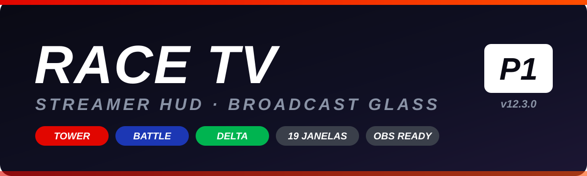
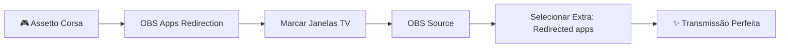

<div align="center">



### 🏁 RACE TV — Broadcast Glass HUD para Assetto Corsa

**A solução definitiva para transmissões de simulação de corrida**

[](../../releases)
[](https://www.assettocorsa.net/)
[](tests/)
[](https://obsproject.com/)
[](https://www.racecraft.com.br/)

**[🌐 Visite o Site](https://silxyst.github.io/RACE.TV/)** • **[📥 Download](../../releases)** • **[📖 Documentação](docs/)** • **[💬 Discussões](../../discussions)**

</div>

---

## ✨ Características Principais

<table align="center">
<tr>
<td align="center" width="50%">

### 🏆 **Torre de Transmissão**
Posição, piloto, pneu, volta, ΔPos, intervalo, última volta com paginação estável e clique para focar

</td>
<td align="center" width="50%">

### ⚔️ **Battle & Comparação**
Dupla automática ou A/B manual, com última volta, média e tendência

</td>
</tr>
<tr>
<td align="center" width="50%">

### 📊 **Telemetria Dedicada**
Delta, Relative, Timing e Combustível do piloto focado em tempo real

</td>
<td align="center" width="50%">

### 🏅 **Multiclass Real**
Tags do `ui_car.json`, paleta com 1 clique, isolamento por categoria

</td>
</tr>
<tr>
<td align="center" width="50%">

### 🎙️ **Painel do Narrador**
Foco, favoritos, comparação, layouts e resultados ao alcance

</td>
<td align="center" width="50%">

### 🚩 **Real Penalty Integration**
Selos DT/SG/TIME/WARN/DQ, safety car e alertas direto do chat

</td>
</tr>
</table>

---

## 📺 Janelas Disponíveis (19 Total)

| Janela | Descrição |
|--------|-----------|
| **TV Tower** | Classificação com posição, piloto, pneu, volta e gap |
| **TV Battle** | Duelo entre dois pilotos |
| **TV Delta** | Delta gigante com previsão |
| **TV Relative** | Rivais próximos (±8s) |
| **TV Telemetry** | Velocidade, RPM, marchas e pedais |
| **TV Inputs** | Entrada de controles suavizada |
| **TV Timing** | Tempos: atual, anterior, melhor |
| **TV Fuel** | Combustível, consumo e autonomia |
| **TV Session** | Série, relógio, bandeira, clima |
| **TV Flags** | Bandeira em grande escala |
| **TV Onboard** | Identificação do piloto focado |
| **TV Spotter** | Carros próximos |
| **TV Map** | Traçado e posições ao vivo |
| **TV Lineup** | Grid antes da largada |
| **TV Alert** | Melhores voltas e punições |
| **TV Narrator** | Painel de narração com controles |
| **TV Results** | Pódio, tabela e recorde da pista |
| **TV Settings** | Todas as configurações |

---

## 🚀 Instalação Rápida

### 1️⃣ Download
Baixe o **[último release](../../releases)** e extraia a pasta `Streamer Hud` para:
```
assettocorsa/apps/lua/
```

### 2️⃣ Ativação
- Abra Assetto Corsa
- Vá para **CSP Apps → Lua Apps**
- Ative **Streamer Hud**
- **Reinicie o AC**

### 3️⃣ Configuração
- Abra as janelas em **Apps → TV Tower, TV Battle, ...**
- Configure tudo em **TV Settings**
- Escolha o layout desejado

---

## 🖥️ Integração com OBS Studio



### Passos:
1. No jogo: **OBS Apps Redirection** → marque as janelas `TV ...`
2. No OBS: selecione **Extra: Redirected apps (transparent)**
3. Pronto! As janelas desaparecem da tela mas continuam renderizando

---

## ⚙️ Guia Rápido de Configuração

| Configuração | Localização | Nota |
|---|---|---|
| **Escala** | `TV Settings → Escala` | Padrão: 12 linhas |
| **Coluna Torre** | `TV_TOWER_MODE` | AUTO / GAP / BEST / TYRE |
| **Multiclass** | `TV Settings` | 12 cores + seletor nativo |
| **Isolar Categoria** | Footer da torre | Um clique para alternar |
| **Layouts** | Salve por perfil | Corrida, Quali, Replay, Vertical |
| **Logo** | `assets/logo.png` | PNG/JPG/DDS/BMP |
| **Real Penalty** | Automático | Funciona sem configurar |

---

## 🧪 Qualidade & Testes

Executar testes:
```bash
python tests/run_audit.py
```

**76 grupos de testes** em LuaJIT:
- ✅ 19 janelas em grids 0–40
- ✅ Escalas e ultrawide
- ✅ UI scale e redirect
- ✅ Cliques e multiclass
- ✅ Real Penalty
- ✅ Viewports pequenas

---

## 📊 Histórico de Versões

| Versão | Destaque |
|--------|----------|
| **12.3** | Real Penalty via chat (selos, alertas, safety car) |
| **12.2** | Torre estilo CMRT (Int + Last), sem códigos, 12 linhas |
| **12.1** | Pneu por linha + polimento (hover, placeholder, divisores) |
| **12.0** | Delta, Relative, Fuel, Session, Flags + recordes |
| **11.5–11.1** | Categorias, pílulas por classe, paleta um clique |
| **11.0–10.2** | Pisca corrigido, clique para focar, narrador |

---

## 🔧 Detalhes Técnicos

<details>
<summary><b>Clique para expandir</b></summary>

- **Callbacks**: Registrados como global (padrão CMRT) e em `script`
- **Desenho**: Confinado à janela (clips) para redirect sem cortes
- **Redimensionamento**: Nenhum callback de desenho redimensiona janelas
- **Posições**: Normalizadas 1..N (jogo às vezes repete/pula `racePosition`)
- **Intervalos**: Medidos por passagem têm prioridade
- **Pneus**: Via `ac.getTyresName` com idade e paradas observadas
- **Gaps**: Nativos (`ac.getGapBetweenCars`) + fallback
- **Real Penalty**: Via `ac.onChatMessage` (leitura)
- **Persistência**: `ac.storage` com prefixo `ETV_*`
- **Tempo**: Em milissegundos, alpha 0..1

</details>

---

## 🎨 Customização Avançada

### Temas
Edite em `Streamer Hud/config/colors.lua`:
```lua
COLORS = {
  PRIMARY = 0xFF1E90FF,      -- Azul
  ACCENT = 0xFFFFD700,       -- Ouro
  DANGER = 0xFFE10600,       -- Vermelho
  SUCCESS = 0xFF00b450       -- Verde
}
```

### Fontes
Coloque arquivos TTF em `Streamer Hud/fonts/`

### Assets Customizados
- Logo: `Streamer Hud/assets/logo.png`
- Sons: `Streamer Hud/assets/sounds/`

---

## 🙏 Referências & Inspiração

Agradecimentos a:
- **CMRT** (Broadcast/Complete)
- **YATTA** e comunidade
- **WEC/NLS/FSH** pela telemetria
- **LapAlly** e **ACTV**
- **F1 25** pelos estilos
- **helicorsa** pela expertise

---

## 📞 Suporte & Contribuição

- 💬 [Discussões](../../discussions) - Dúvidas e sugestões
- 🐛 [Issues](../../issues) - Reportar bugs
- 📖 [Wiki](../../wiki) - Documentação técnica
- 🌟 Gostou? Deixe uma estrela ⭐

---

<div align="center">

### Feito com ❤️ para a comunidade de simulação de corrida

**[Visite o Site](https://silxyst.github.io/RACE.TV/)** • **[Baixe Agora](../../releases)**

</div>